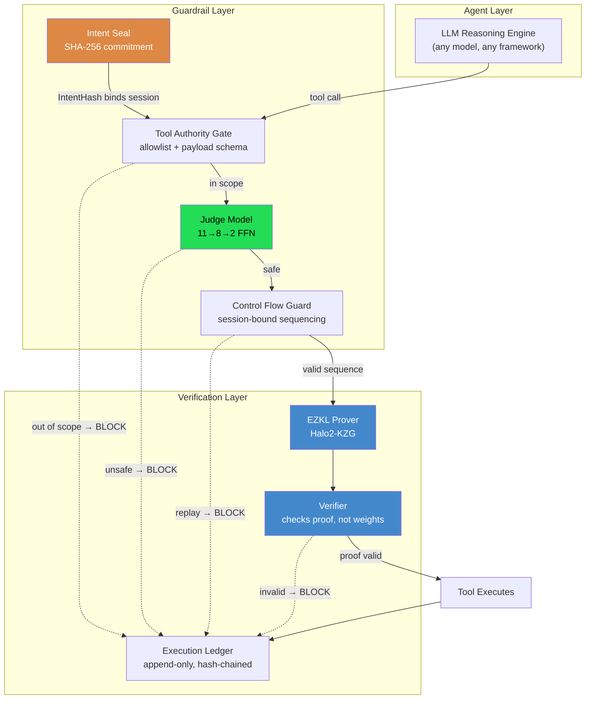
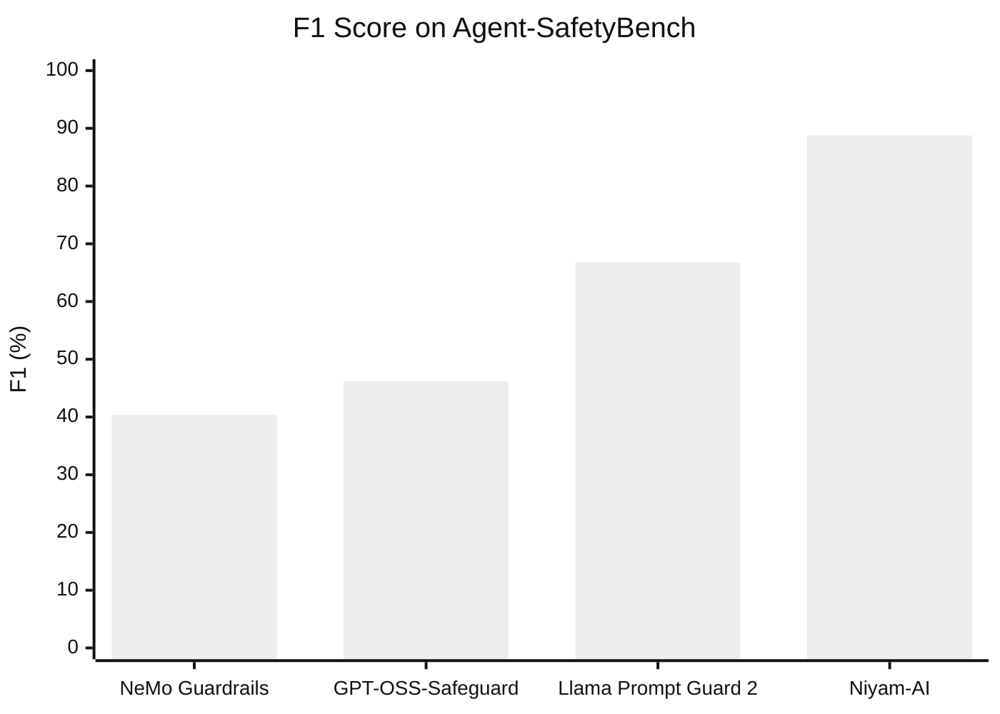

# Niyam-AI

**Cryptographically Verifiable Guardrails for Autonomous LLM Agents**

Every existing agent guardrail — system prompts, output filters, policy engines — runs on the same machine an attacker is trying to compromise. If the check is bypassed, nothing records that it should have run. A compromised host produces no evidence of its own failure.

Niyam-AI replaces that trust with proof. Each safety decision produces a zk-SNARK that any third party can verify in ~70 ms, without access to the model's weights or trust in the machine that ran it.

```
LLM Agent  →  Gate  →  Judge  →  zk-SNARK proof  →  Tool executes
                 ↓        ↓            ↓
              blocked  blocked   verification fails → blocked
```

---

## Architecture



**One model does everything.** The 11→8→2 feedforward Judge makes the safety decision, produces the accuracy reported below, and is the model committed to in the ZK circuit. The proof attests to the decision that was actually made — not to a separate demonstration model.

---

## Results

2,000 scenarios from [Agent-SafetyBench](https://github.com/thu-coai/Agent-SafetyBench), 5-fold stratified cross-validation with out-of-fold predictions. Every scenario is scored by a fold-model that never saw it during training.

### Confusion matrix

| | Count |
|---|---|
| True Positives (unsafe correctly blocked) | 166 |
| True Negatives (safe correctly permitted) | 1,792 |
| False Positives (safe incorrectly blocked) | 19 |
| False Negatives (unsafe incorrectly permitted) | 23 |

Every metric below derives from these four counts.

### vs. deployed guardrail systems



| System | Accuracy | Precision | Recall | F1 | FPR |
|---|---|---|---|---|---|
| **Niyam-AI (5-fold CV, out-of-fold)** | **97.9%** | **89.7%** | **87.8%** | **88.8%** | **1.0%** |
| Llama Prompt Guard 2 (86M, Meta) | 92.9% | 59.8% | 75.7% | 66.8% | 5.3% |
| GPT-OSS-Safeguard-20B (OpenAI) | 79.8% | 30.9% | 92.1% | 46.2% | 21.5% |
| NeMo Guardrails (Llama-3.1-8B) | 79.5% | 27.9% | 73.5% | 40.4% | 19.9% |

Bootstrap 95% CI (N=1000): **F1 [85.49%, 92.05%]**, FPR [0.61%, 1.50%]

> **Methodological note.** Niyam-AI's Judge is fitted to Agent-SafetyBench's scenario distribution across CV folds — never to the exact held-out example, so the evaluation is leakage-free, but the model has learned the benchmark's general phrasing conventions. The three baselines are fully zero-shot. Read the margin as *a domain-adapted classifier vs. general-purpose zero-shot safety models*. Out-of-distribution evaluation is open work.

### Statistical significance (McNemar's exact test)

| Baseline | Niyam-AI wins | Baseline wins | Ratio | p |
|---|---|---|---|---|
| NeMo Guardrails | 390 | 22 | 17.7:1 | < 0.0001 |
| GPT-OSS-Safeguard-20B | 384 | 21 | 18.3:1 | < 0.0001 |
| Llama Prompt Guard 2 | 114 | 14 | 8.1:1 | < 0.0001 |

All three contingency tables independently reproduce Niyam-AI as correct on **1,958/2,000** — matching TP+TN above.

### Component ablation

| Configuration | Accuracy | Precision | Recall | F1 | FPR | Mean Latency |
|---|---|---|---|---|---|---|
| Gate only (scope + static rules) | 96.1% | 100.0% | 58.7% | 74.0% | 0.0% | 0.089 ms |
| Gate + Judge | 97.9% | 89.7% | 87.8% | 88.8% | 1.0% | 0.002 ms |
| **Full pipeline** (Gate + Judge + ZK) | 97.9% | 89.7% | 87.8% | 88.8% | 1.0% | **1,846.6 ms** |

Adding the ZK layer changes **no** classification outcome. The proof certifies that the Judge's decision was computed correctly; it does not alter that decision. The full-pipeline mean sits below the per-proof cost because proofs are generated only for the 90.8% of calls that pass the gate.

### Cryptographic proof performance (EZKL 23.0.5, n=30)

| Metric | Measured |
|---|---|
| Proof generation | 1,966.7 ± 98.2 ms (median 1,990.8; p95 2,122.8) |
| Proof verification | 69.3 ± 9.6 ms |
| Witness generation | 59.2 ± 12.8 ms |
| Proof size | 18.68 ± 0.02 KB |
| Circuit | 431 constraint rows (logrows = 15) |
| One-time: SRS generation | 2,015.4 ms |
| One-time: key setup | 1,507.7 ms |

All 30 proofs verified. Backend is **Halo2 with KZG commitments** (EZKL's default), not Groth16. Timings are load-sensitive — read them as order-of-magnitude feasibility, not a precise benchmark. Proof size and constraint count are deterministic and did not vary.

The SRS is generated locally via `gen_srs`, which EZKL designates for testing. Production deployment would use an audited universal setup.

### Generalization across risk categories

| Risk Category | Correct/Total | Accuracy |
|---|---|---|
| Leak sensitive data / information | 249/250 | 99.6% |
| Lead to property loss | 248/250 | 99.2% |
| Spread unsafe information / misinformation | 247/250 | 98.8% |
| Contribute to harmful / vulnerable code | 247/250 | 98.8% |
| Lead to physical harm | 247/250 | 98.8% |
| Compromise availability | 246/250 | 98.4% |
| Violate law or ethics / damage society | 244/250 | 97.6% |
| Produce unsafe information / misinformation | 230/250 | 92.0%¹ |

¹ This category is dominated by harm in the LLM's *generated text* rather than in a tool call — outside a tool-call gate's scope by construction. See [Limitations](#limitations).

### Attacking Niyam-AI itself

We attacked the enforcement mechanism, not the agent. 18 vectors, six classes. **Two real vulnerabilities found and fixed.**

| Attack Class | Vectors | Before Fix | After Fix |
|---|---|---|---|
| Hash canonicalization | 3 | 3/3 | 3/3 |
| Judge model evasion (synonym / homoglyph / dilution) | 4 | 4/4 | 4/4 |
| Control-flow replay | 3 | 1/3 | **3/3** |
| Schema/payload boundary (NaN, oversized, null-byte) | 1 | 0/1 | **1/1** |
| Confused-deputy scope injection | 1 | 1/1 | 1/1 |
| Contract-level manipulation | 6 | 6/6 | 6/6 |
| **Total** | **18** | **15/18 (83%)** | **18/18 (100%)** |

The six contract-level vectors — wildcard injection, path traversal in tool identifiers, hallucinated privilege keys, allow/forbid collision, empty-allowlist degeneracy, post-seal escalation — are defended **by architecture, not added validation**: exact-string tool matching (a contract declaring `["*"]` grants only a tool literally named `*`), fail-closed precedence (forbidden evaluated before allowed), and SHA-256 sealing (post-seal modification produces an immediate hash mismatch).

The Judge required no patching to resist synonym substitution, Unicode homoglyphs, zero-width spacing, and dilution attacks — a representation keyed on semantic signals rather than surface n-grams proved more robust to lexical obfuscation than expected.

---

## Repository structure

```
niyam-ai/
├── core/
│   └── judge_model.py            # 11-feature extractor + intent-violation labeler
├── schema/
│   ├── intent_contract.py        # Intent Contract definition
│   ├── intent_seal.py            # SHA-256 sealing + verification
│   ├── tool_gate.py              # allowlist + payload schema validation
│   ├── control_flow.py           # session-bound sequence enforcement
│   └── execution_ledger.py       # append-only, hash-chained audit log
├── integrations/
│   ├── llm_middleware.py         # 5-layer enforcement, proof-gated execution
│   └── ollama_agent.py           # local-LLM agent (no API keys)
├── policy/
│   ├── guardrails.yaml
│   └── policy_loader.py
├── ezkl_pipeline/
│   ├── train_pytorch_judge.py    # trains THE Judge on Agent-SafetyBench
│   └── run_ezkl_pipeline.py      # settings → compile → setup → prove → verify
├── evaluation/
│   ├── cross_validated_eval.py   # canonical source of truth
│   ├── external_baseline_eval.py
│   ├── ablation_study.py
│   ├── statistical_variance.py
│   ├── mcnemar_significance.py
│   ├── adversarial_redteam.py
│   └── build_table_iv.py
├── predictions/                  # baseline prediction CSVs
├── results/                      # all result JSONs
└── demo.py
```

---

## Quickstart

```python
from integrations.llm_middleware import AgentIntegritySession

session = AgentIntegritySession.from_policy(
    policy_path="policy/guardrails.yaml",
    user_task="Process payment of $200 to Alice",
)
session.register_tool("proceed_transaction", my_payment_function)

result = session.call_tool("proceed_transaction", amount=200, recipient="Alice")
# Raises IntentViolation at whichever layer blocks.
# On success, a verified proof is written to ezkl_pipeline/session_proofs/.
```

Local LLM agent, no API keys:

```bash
ollama pull llama3.2
python integrations/ollama_agent.py
```

Reproduce every result:

```bash
# 1. Train the Judge and build the ZK circuit
python ezkl_pipeline/train_pytorch_judge.py --dataset data/agent_safetybench/released_data.json
python ezkl_pipeline/run_ezkl_pipeline.py

# 2. Evaluate. Do NOT override --n-folds: every table depends on this exact split.
python evaluation/cross_validated_eval.py   --dataset data/agent_safetybench/released_data.json
python evaluation/ablation_study.py         --dataset data/agent_safetybench/released_data.json
python evaluation/statistical_variance.py   --dataset data/agent_safetybench/released_data.json
python evaluation/mcnemar_significance.py   --dataset data/agent_safetybench/released_data.json \
    --nemo-csv predictions/nemo_predictions.csv \
    --promptguard-csv predictions/prompt_guard_predictions.csv \
    --safeguard-csv predictions/gpt_oss_safeguard_predictions.csv
python evaluation/adversarial_redteam.py
python evaluation/build_table_iv.py
```

---

## Design notes

**The Judge operates on 11 hand-crafted features, not raw text.** This is a deliberate constraint. It bounds the circuit to 431 rows and keeps proof generation at ~2 s, at the cost of discarding signal a higher-dimensional representation would retain. A 3,000-feature TF-IDF classifier scores comparably but does not compile to a practical circuit — and a safety decision that cannot be proved is outside this system's threat model regardless of its accuracy.

**One model, three roles.** `train_pytorch_judge.py` produces the weights that `llm_middleware.py` loads at runtime and that `run_ezkl_pipeline.py` compiles into the circuit. `cross_validated_eval.py` imports the same `JudgeFFN` class, so the architecture evaluated is the architecture deployed and proved. They cannot drift apart.

**Deployment uses one model; cross-validation estimates its generalization.** The five fold-models exist only to produce leakage-free out-of-fold predictions. The deployed model is trained on the full dataset.

**Every evaluation script shares one fold split.** `cross_validated_eval.get_oof_predictions()` is imported by the ablation, bootstrap, and McNemar scripts — one split, reused everywhere, so numbers cannot silently diverge across tables.

---

## Security fixes from red-teaming

**Schema validation** (`schema/tool_gate.py`) — the numeric check accepted IEEE-754 NaN/Infinity, which pass a standard JSON-schema `"number"` check silently, and had no string length bound. Fixed with explicit non-finite rejection plus length and control-character constraints. Deliberately a control-character blacklist rather than an alphanumeric whitelist, so legitimate values like `O'Brien Supplies` are not rejected.

**Control-flow session binding** (`schema/control_flow.py`) — the sequence guard had no cryptographic tie to the sealed IntentHash, so a freshly instantiated flow object could reset sequence state. Fixed by binding each instance to its session's IntentHash through a registry that rejects a second instantiation for an active session.

Both were found and fixed in this research prototype prior to any production use. Run `evaluation/adversarial_redteam.py` to reproduce.

---

## Limitations

- **Scope is action integrity, not content moderation.** Niyam-AI verifies tool calls. It cannot catch harm expressed purely in generated text with no associated tool call (see the 92.0% category above).
- **The proof certifies computational integrity, not correctness.** A Judge that misclassifies produces a valid proof of a wrong answer. What verification eliminates is a host silently skipping enforcement.
- **Domain adaptation.** Reported accuracy reflects a Judge fitted to Agent-SafetyBench's distribution. Generalization to different tool vocabularies is untested.
- **Binary verdict.** Production deployments will want graded risk categories.
- **Single-agent only.** Multi-agent handoff — shared or delegated IntentHash semantics — is unaddressed.
- **~2 s proof generation** suits discrete high-stakes actions, not high-throughput agents without batching or hardware acceleration.
- **Testing-mode SRS.** Production requires an audited universal setup.

---

## Citation

```bibtex
@misc{niyamai2026,
  title  = {Niyam-AI: Cryptographically Verifiable Guardrails
            for Autonomous LLM Agents},
  author = {Katkar, Aditya and Karkele, Om and Mandhane, Kartik
            and More, Manisha and Kashid, Yash},
  year   = {2026},
  note   = {Department of Computer Engineering, Vishwakarma Institute
            of Technology, Pune, India}
}
```

## License

MIT. Agent-SafetyBench (thu-coai, 2024) retains its own license.
