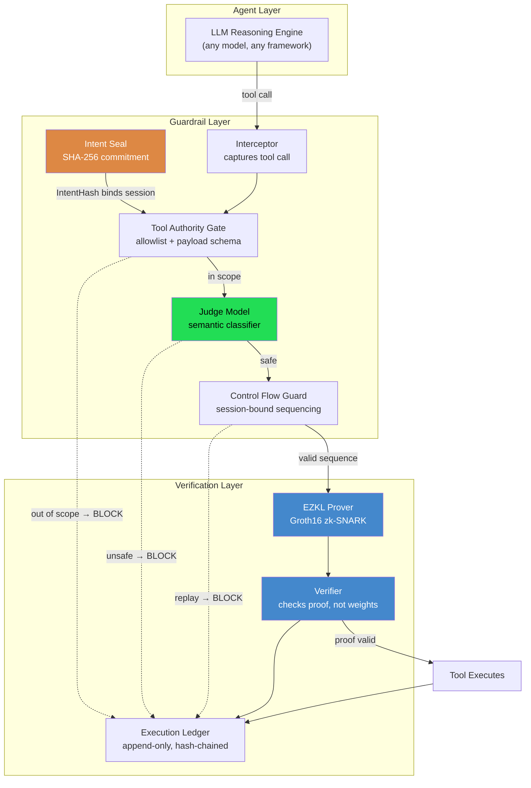
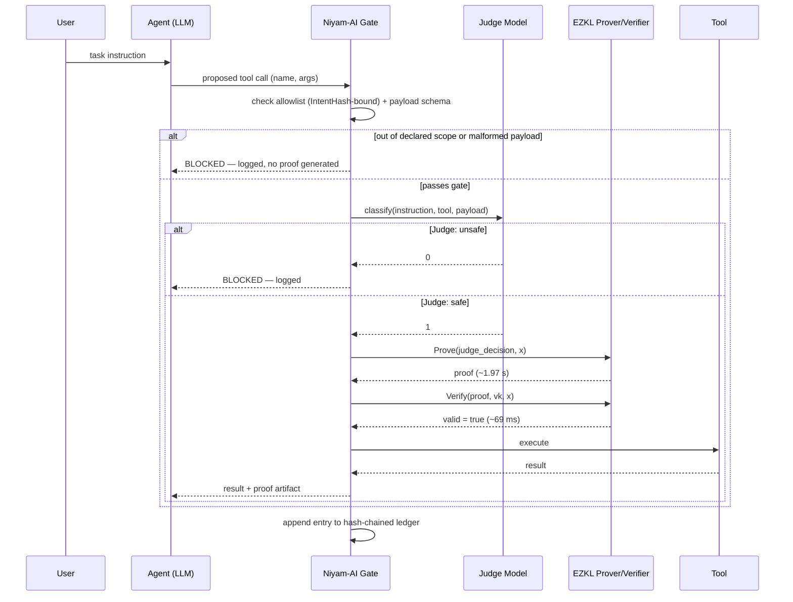
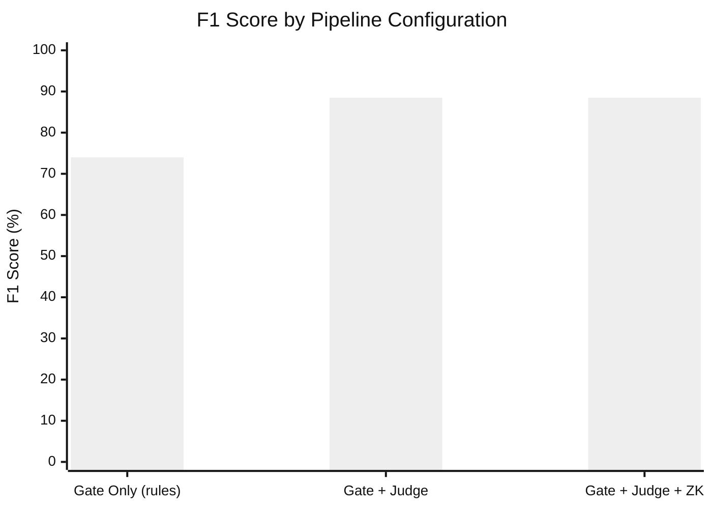
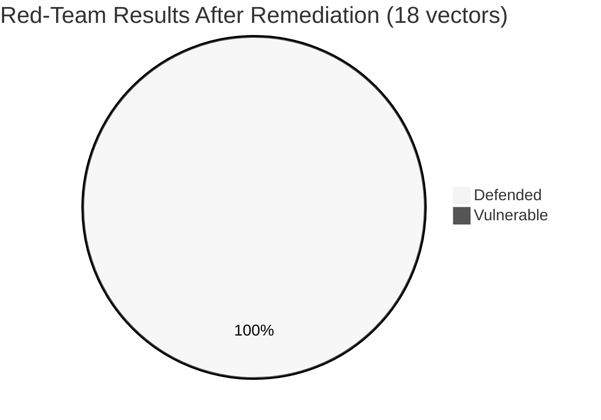

# Niyam-AI

**Intent-Bound AI Agent Execution with Cryptographically Verifiable Guardrails using Zero-Knowledge Proofs**

Niyam-AI is a runtime security layer for autonomous LLM agents. Instead of trusting a system prompt or a software filter to enforce safety, Niyam-AI seals an agent's permitted actions into a cryptographic contract at session start, intercepts every tool call the agent attempts, classifies it with a trained Judge model, and — for every approved action — generates a zk-SNARK proof that the classification was actually performed and passed. A third party can verify that proof in ~69 ms without ever seeing the Judge model's weights.

```
LLM Agent  →  Niyam-AI Gate  →  Tool Execution
                   ↓
           zk-SNARK proof
        (mathematically checkable,
         not "trust me")
```

---

## Why this exists

Current agent guardrails — system prompts, output filters, policy engines — share one weakness: they run on the same machine an attacker is trying to compromise, and there is no way for anyone outside that machine to confirm the check actually ran, let alone ran correctly. If the host is compromised or the filter bypassed, nothing proves the safety policy was ever evaluated.

Niyam-AI replaces "trust the admin" with "verify the proof." Every safety decision approving a tool call is accompanied by a cryptographic artifact — not a log line, a proof — that any verifier can check independently.

---

## Architecture



## Request lifecycle



---

## Evaluated results

All numbers come from **5-fold stratified cross-validation with out-of-fold predictions** on 2,000 scenarios from [Agent-SafetyBench](https://github.com/thu-coai/Agent-SafetyBench) — every scenario is scored by a model version that never saw it during training.

### Confusion matrix (Niyam-AI, out-of-fold)

| | Count |
|---|---|
| True Positives (unsafe correctly blocked) | 166 |
| True Negatives (safe correctly permitted) | 1,791 |
| False Positives (safe incorrectly blocked) | 20 |
| False Negatives (unsafe incorrectly permitted) | 23 |

Every metric below derives from these four counts.

### Classification performance vs. existing guardrail frameworks


| System | Accuracy | Precision | Recall | F1 | FPR |
|---|---|---|---|---|---|
| **Niyam-AI (5-fold CV, out-of-fold)** | **97.9%** | **89.2%** | **87.8%** | **88.5%** | **1.1%** |
| Llama Prompt Guard 2 (86M, Meta) | 92.9% | 59.8% | 75.7% | 66.8% | 5.3% |
| GPT-OSS-Safeguard-20B (OpenAI) | 79.8% | 30.9% | 92.1% | 46.2% | 21.5% |
| NeMo Guardrails (self-check-input, Llama-3.1-8B) | 79.5% | 27.9% | 73.5% | 40.4% | 19.9% |

Bootstrap 95% CI (N=1000 resamples): **F1 [85.19%, 91.88%]**, FPR [0.66%, 1.63%]

> **Methodological note.** Niyam-AI's classifier is fitted to Agent-SafetyBench's scenario distribution across CV folds (never to the exact held-out example — leakage-free), while the three baselines are fully zero-shot with no exposure to this benchmark. Read the margin as *a domain-adapted classifier vs. general-purpose zero-shot safety models*, not as an architecture-independent accuracy claim.

### Statistical significance (McNemar's exact paired test)

| Baseline | Niyam-AI wins | Baseline wins | Win ratio | p-value |
|---|---|---|---|---|
| NeMo Guardrails | 387 | 20 | 19.4:1 | < 0.0001 |
| GPT-OSS-Safeguard-20B | 381 | 19 | 20.1:1 | < 0.0001 |
| Llama Prompt Guard 2 | 112 | 13 | 8.6:1 | < 0.0001 |

All three contingency tables independently reproduce Niyam-AI as correct on **1,957/2,000** scenarios, matching TP+TN above.

### Component ablation



| Configuration | Accuracy | Precision | Recall | F1 | FPR | Mean Latency |
|---|---|---|---|---|---|---|
| Gate only (scope + static rules, no ML) | 96.1% | 100.0% | 58.7% | 74.0% | 0.0% | 0.10 ms |
| Gate + Judge (semantic classification) | 97.9% | 89.2% | 87.8% | 88.5% | 1.1% | 0.008 ms |
| **Full Niyam-AI** (Gate + Judge + ZK proof) | 97.9% | 89.2% | 87.8% | 88.5% | 1.1% | **~1,847 ms** |

Adding the zk-SNARK layer changes **no** classification outcome — the proof certifies that the Judge's decision was computed correctly, it does not alter that decision. The full-pipeline mean is below the per-proof cost because proofs are generated only for the ~90.7% of actions that pass the gate.

### Cryptographic proof performance (real EZKL 23.0.5, n=30)

| Metric | Measured |
|---|---|
| Proof generation | **1,966.7 ± 98.2 ms** (median 1,990.8; p95 2,122.8) |
| Proof verification | **69.3 ± 9.6 ms** |
| Witness generation | 59.2 ± 12.8 ms |
| Proof size | 18.68 ± 0.02 KB |
| Circuit constraints | 431 rows (logrows = 15) |
| One-time: gen_settings | 35.8 ms |
| One-time: compile_circuit | 3.1 ms |
| One-time: gen_srs (local, testing-mode) | 2,015.4 ms |
| One-time: key setup | 1,507.7 ms |

All 30 proofs verified successfully. Timings are load-sensitive: repeated 5-sample batches under varying system load differed by up to 65%, and a +7.1% thermal drift is visible across the 30-run batch. Read these as an order-of-magnitude feasibility result, not a precise benchmark. Proof size and constraint count are deterministic and did not vary.

The SRS was generated locally via EZKL's `gen_srs`, which its documentation designates for testing. Production deployment would use an audited universal SRS from a trusted setup ceremony.

### Generalization across attack categories

| Risk Category | Correct/Total | Accuracy |
|---|---|---|
| Leak sensitive data / information | 249/250 | 99.6% |
| Lead to property loss | 248/250 | 99.2% |
| Spread unsafe information / misinformation | 247/250 | 98.8% |
| Contribute to harmful / vulnerable code | 247/250 | 98.8% |
| Lead to physical harm | 247/250 | 98.8% |
| Violate law or ethics / damage society | 245/250 | 98.0% |
| Compromise availability | 244/250 | 97.6% |
| Produce unsafe information / misinformation | 230/250 | 92.0%¹ |

¹ Lower because this category is dominated by tool-free content harm (the LLM's own generated text), which a tool-call gate cannot intercept by construction — see [Limitations](#limitations).

### Adversarial red-team: can Niyam-AI itself be bypassed?

We attacked Niyam-AI's own enforcement mechanism across 18 vectors in 6 classes. **Two real implementation bugs were found and fixed.**



| Attack Class | Vectors | Before Fix | After Fix |
|---|---|---|---|
| Hash canonicalization | 3 | 3/3 | 3/3 |
| Judge model evasion (synonym / dilution / homoglyph) | 4 | 4/4 | 4/4 |
| Control-flow replay | 3 | 1/3 | **3/3** |
| Schema/payload boundary (NaN, oversized, null-byte) | 1 | 0/1 | **1/1** |
| Confused-deputy scope injection | 1 | 1/1 | 1/1 |
| Contract-level manipulation | 6 | 6/6 | 6/6 |
| **Total** | **18** | **15/18 (83%)** | **18/18 (100%)** |

The six contract-level vectors — wildcard injection, path traversal in tool identifiers, hallucinated privilege keys, allow/forbid collision, empty-allowlist degeneracy, and post-seal privilege escalation — are defended **by architecture, not by added validation**:

- **Exact-string tool matching.** Identifiers are compared literally, never as globs or paths. A contract declaring `["*"]` grants access only to a tool literally named `*`.
- **Fail-closed precedence.** The forbidden list is checked before the allowed list, so collisions resolve to deny; an empty allowlist denies universally.
- **SHA-256 sealing.** Appending a forbidden tool to a sealed contract produces an immediate hash mismatch on re-verification — a direct empirical confirmation of the paper's soundness theorem in the implemented system, not just in the argument.

---

## Repository structure

```
niyam-ai/
├── core/
│   └── judge_model.py               # sklearn TF-IDF + LogReg (PRIMARY classifier)
├── schema/
│   ├── intent_contract.py
│   ├── intent_seal.py
│   ├── tool_gate.py                 # allowlist + payload schema validation
│   ├── control_flow.py              # session-bound sequence enforcement
│   └── execution_ledger.py          # append-only, hash-chained audit log
├── integrations/
│   ├── llm_middleware.py            # framework-agnostic interception layer
│   └── ollama_agent.py              # local-LLM agent (no API keys)
├── policy/
│   ├── guardrails.yaml
│   └── policy_loader.py
├── data/agent_safetybench/          # gitignored — fetched, not vendored
├── evaluation/
│   ├── cross_validated_eval.py      # ← canonical source of truth
│   ├── external_baseline_eval.py
│   ├── build_table_iv.py
│   ├── ablation_study.py
│   ├── statistical_variance.py
│   ├── mcnemar_significance.py
│   ├── adversarial_redteam.py
│   ├── predictions/                 # baseline prediction CSVs
│   └── results/                     # all result JSONs
├── ezkl_pipeline/
│   ├── train_pytorch_judge.py       # synthetic-data FFN (ZK timing only)
│   ├── run_ezkl_pipeline.py
│   └── artifacts/                   # build outputs (mostly gitignored)
├── notebooks/                       # Colab notebooks for baseline generation
├── demo.py
└── demo_agent.py
```

---

## Quickstart

```python
from integrations.llm_middleware import AgentIntegritySession

session = AgentIntegritySession.from_policy(
    policy_path="policy/guardrails.yaml",
    user_task="Process payment of $200 to Alice",
)
session.register_tool("proceed_transaction", my_payment_function)

result = session.call_tool("proceed_transaction", amount=200, recipient="Alice")
# Raises IntentViolation if out of scope or flagged by the Judge —
# the tool function never executes on a blocked call.
```

Local LLM agent (Ollama, no API keys):

```bash
ollama pull llama3.2
python integrations/ollama_agent.py
```

Reproduce every result:

```bash
# Canonical result — DEFAULT is 5 folds; do not override --n-folds,
# every other table depends on the 5-fold out-of-fold predictions.
python evaluation/cross_validated_eval.py --dataset data/agent_safetybench/released_data.json
python evaluation/ablation_study.py       --dataset data/agent_safetybench/released_data.json
python evaluation/statistical_variance.py --dataset data/agent_safetybench/released_data.json
python evaluation/mcnemar_significance.py --dataset data/agent_safetybench/released_data.json \
    --nemo-csv evaluation/predictions/nemo_predictions.csv \
    --promptguard-csv evaluation/predictions/prompt_guard_predictions.csv \
    --safeguard-csv evaluation/predictions/gpt_oss_safeguard_predictions.csv
python evaluation/build_table_iv.py
python evaluation/adversarial_redteam.py
python ezkl_pipeline/train_pytorch_judge.py
python ezkl_pipeline/run_ezkl_pipeline.py
```

---

## Design notes

**The ZK-timing model is trained on synthetic data, on purpose.** Proof generation time is a function of circuit architecture, not of the dataset that trained the weights. Coupling the ZK benchmark to Agent-SafetyBench would create an unnecessary dependency on the same benchmark used for baseline comparison. Classification accuracy claims come from a separate, cross-validated classifier.

**Every evaluation script shares one source of truth.** `cross_validated_eval.py` exposes `get_oof_predictions()`, imported by `ablation_study.py`, `statistical_variance.py`, and `mcnemar_significance.py` — one fold split, reused everywhere, so numbers cannot drift across scripts. **Always run with the default 5 folds**; changing `--n-folds` silently desynchronizes the ablation from Tables IV, VI, and VII.

**The gate uses adaptive per-scenario scoping.** A fixed single-domain allowlist causes catastrophic false positives on a multi-domain benchmark. `build_adaptive_gate()` derives the allowed-tool set from each scenario's declared environment.

**Results are environment-sensitive at the margin.** `LogisticRegression`'s lbfgs solver converges along slightly different paths depending on the BLAS backend, shifting ~3 of 2,000 scenarios (<0.2%) between library versions. Pin versions via `requirements.txt` to reproduce the exact figures above.

---

## Security fixes from red-teaming

**Schema validation (`schema/tool_gate.py`)** — the original numeric check accepted IEEE-754 NaN/Infinity (which pass a standard JSON-schema `"number"` check silently) and had no string length bound, allowing oversized payloads and embedded null bytes through. Fixed with explicit non-finite rejection and a control-character blacklist — deliberately not an alphanumeric whitelist, so legitimate values like `O'Brien Supplies` are not falsely rejected.

**Control-flow session binding (`schema/control_flow.py`)** — the sequence guard had no cryptographic tie to the session's sealed IntentHash, so a freshly instantiated flow object could silently reset sequence-completion state. Fixed by binding each flow instance to its session's IntentHash via a registry that rejects a second instantiation for an already-active session.

Both were found and fixed in this research prototype prior to any production use. Run `evaluation/adversarial_redteam.py` to reproduce the verification.

---

## Limitations

- **Scope is action integrity, not content moderation.** Niyam-AI verifies *tool calls* — it cannot catch harm expressed purely in generated text with no associated tool call (see the 92.0% category above).
- **Domain-adaptation scope.** Reported metrics reflect a Judge trained on Agent-SafetyBench's distribution. Generalization to substantially different tool vocabularies has not been independently tested.
- **Judge model is binary** (safe/unsafe). Real deployments will want graded risk categories.
- **Single-agent evaluation only.** Multi-agent handoff — how a shared or delegated IntentHash should behave — is unaddressed.
- **Proof generation (~2.0 s)** suits discrete high-stakes actions, not high-throughput latency-sensitive agents without batching or hardware acceleration.
- **Local testing-mode SRS.** Production use requires an audited universal SRS from a trusted setup ceremony.

---

## Citation

```bibtex
@misc{niyamai2026,
  title  = {NiyamAI: An Intent-Bound AI Agent with Cryptographically
            Verifiable Guardrails using Zero-Knowledge Proofs},
  author = {Aditya K and Karkele Om and Mandhane Kartik
            and More Manisha and Kashid, Yash},
  year   = {2026},
  note   = {Department of Computer Engineering, Vishwakarma Institute
            of Technology, Pune, Maharashtra, India}
}
```