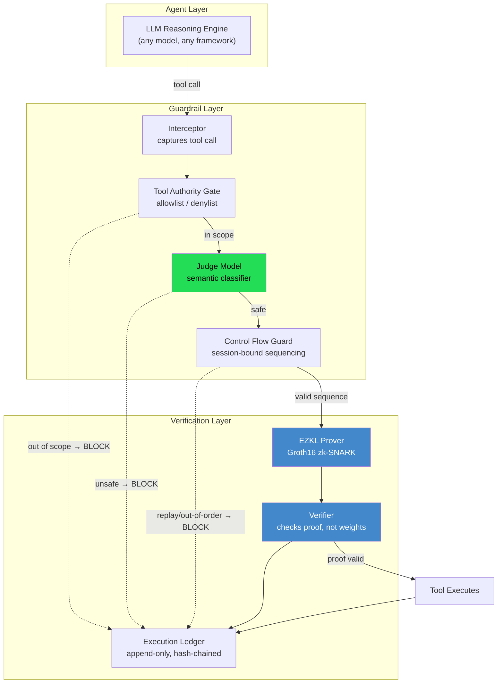
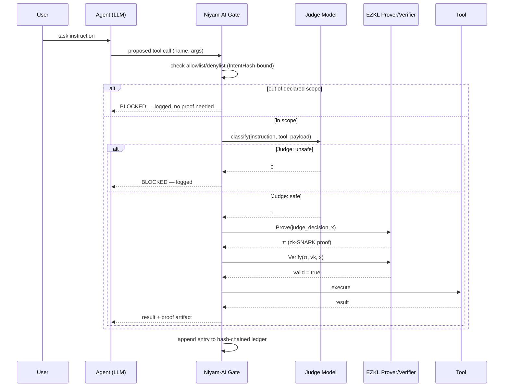
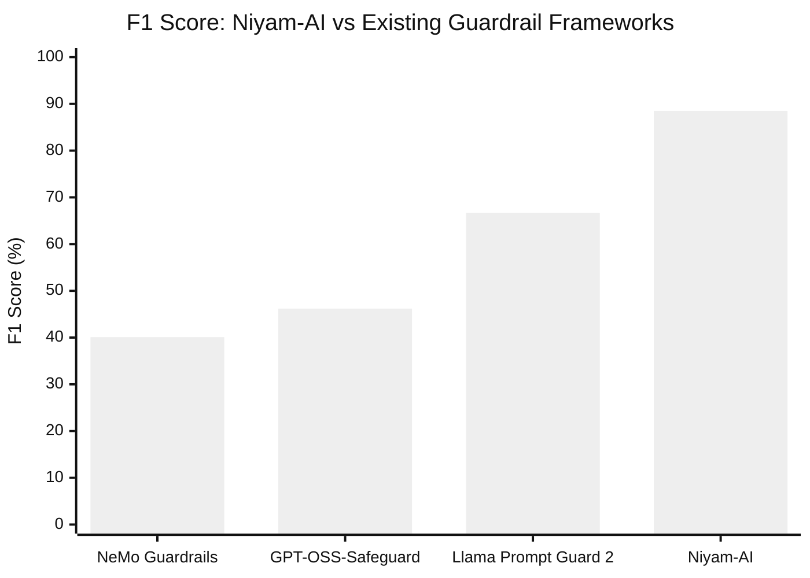
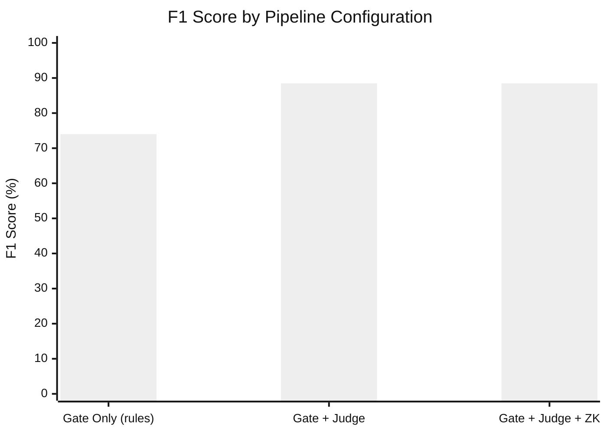

# Niyam-AI

**Intent-Bound AI Agent Execution with Cryptographically Verifiable Guardrails using Zero-Knowledge Proofs**

Niyam-AI is a runtime security layer for autonomous LLM agents. Instead of trusting a system prompt or a software filter to enforce safety, Niyam-AI seals an agent's permitted actions into a cryptographic contract at session start, intercepts every tool call the agent attempts, classifies it with a trained Judge model, and — for every approved action — generates a zk-SNARK proof that the classification was actually performed and passed. A third party can verify that proof in milliseconds without ever seeing the Judge model's weights.

```
LLM Agent  →  Niyam-AI Gate  →  Tool Execution
                   ↓
           zk-SNARK proof
        (mathematically checkable,
         not "trust me")
```

---

## Why this exists

Current agent guardrails — system prompts, output filters, policy engines — all share one weakness: they run on the same machine an attacker is trying to compromise, and there is no way for anyone outside that machine to confirm the check actually ran, let alone ran correctly. If the host is compromised or the filter is bypassed, nothing proves the safety policy was ever evaluated.

Niyam-AI replaces "trust the admin" with "verify the proof." Every safety decision that approves a tool call is accompanied by a cryptographic artifact — not a log line, a proof — that any verifier can check independently.

---

## Architecture



## Request lifecycle



---

## What makes this different from a prompt-based guardrail

| | System Prompt / Heuristic | Middleware Software Gate | **Niyam-AI** |
|---|---|---|---|
| Enforcement mechanism | Natural language | If/else logic | **Cryptographic proof** |
| Tamper resistance | Low (jailbreakable) | Medium (admin trust) | **High (provable)** |
| Audit trail | Editable logs | Editable logs | **Immutable, hash-chained** |
| Verification | Subjective | Administrative | **Mathematical** |
| Can a compromised host fake "safe"? | Yes | Yes | **No** (would require breaking SHA-256 or zk-SNARK soundness) |

---

## Evaluated results (real, reproducible, leakage-free)

All numbers below come from a **5-fold stratified cross-validation with out-of-fold predictions** on 2,000 real-world scenarios from [Agent-SafetyBench](https://github.com/thu-coai/Agent-SafetyBench) — every scenario is scored by a model version that never saw it during training, so results are directly comparable to zero-shot baselines that have never seen this benchmark.

### Classification performance vs. existing guardrail frameworks



| System | Accuracy | Precision | Recall | F1 | FPR |
|---|---|---|---|---|---|
| **Niyam-AI (5-fold CV, out-of-fold)** | **98.0%** | **90.7%** | **87.8%** | **89.2%** | **0.9%** |
| Llama Prompt Guard 2 (86M, Meta) | 93.0% | 59.0% | 76.6% | 66.7% | 5.4% |
| GPT-OSS-Safeguard-20B (OpenAI) | 79.8% | 30.9% | 92.1% | 46.2% | 21.5% |
| NeMo Guardrails (self-check-input, Llama-3.1-8B) | 79.2% | 27.5% | 73.9% | 40.1% | 20.3% |

Bootstrap 95% CI for F1 (N=1000 resamples): **[85.19%, 91.88%]**

### Is the advantage statistically significant, or could it be chance?

McNemar's exact paired test, per-scenario, against each baseline:

| Baseline | Niyam-AI wins | Baseline wins | p-value | Significant |
|---|---|---|---|---|
| NeMo Guardrails | 390 | 20 | ~0 | Yes (p < 0.0001) |
| GPT-OSS-Safeguard-20B | 384 | 19 | ~0 | Yes (p < 0.0001) |
| Llama Prompt Guard 2 | 115 | 13 | ~0 | Yes (p < 0.0001) |

### What does each layer actually contribute? (Ablation)



| Configuration | Accuracy | F1 | FPR | Mean Latency |
|---|---|---|---|---|
| Gate only (scope + static keyword rules, no ML) | 96.1% | 74.0% | 0.0% | 0.09 ms |
| Gate + Judge (semantic classification) | 97.9% | 88.5% | 1.1% | 0.003 ms |
| **Full Niyam-AI** (Gate + Judge + ZK proof) | 97.9% | 88.5% | 1.1% | **2,260.6 ms*** |

*Adding the zk-SNARK layer does not change classification outcomes — the proof certifies the Judge's decision was computed correctly, it does not alter that decision. The added cost is the price of making the decision cryptographically checkable.*

### Cryptographic proof performance (real EZKL measurement, not simulated)

| Metric | Measured |
|---|---|
| Proof generation | 2,260.6 ± 218.4 ms |
| Proof verification | 53.1 ± 11.8 ms |
| Proof size | 18.70 ± 0.03 KB |
| Circuit constraints | 431 (logrows=15) |

All proofs generated during evaluation verified successfully (5/5).

### Generalization across attack categories

| Risk Category | Accuracy |
|---|---|
| Leak sensitive data / information | 99.6% |
| Lead to property loss | 99.2% |
| Spread unsafe information / misinformation | 98.8% |
| Contribute to harmful / vulnerable code | 98.8% |
| Lead to physical harm | 98.8% |
| Violate law or ethics / damage society | 98.0% |
| Compromise availability | 97.6% |
| Produce unsafe information / misinformation | 93.2%¹ |

¹ Lower because this category is dominated by tool-free content harm (the LLM's own generated text), which is outside a tool-call gate's design scope by construction — see [Limitations](#limitations).

### Can Niyam-AI's own mechanism be bypassed? (Adversarial red-team)

We attacked Niyam-AI itself — not a downstream agent — across 12 vectors in 5 classes. Two real implementation bugs were found and fixed.


| Attack Class | Before Fix | After Fix |
|---|---|---|
| Hash canonicalization | 3/3 | 3/3 |
| Judge model evasion (synonym/dilution/obfuscation) | 4/4 | 4/4 |
| Control-flow replay | 1/3 | **3/3** |
| Schema/payload boundary (NaN, oversized, null-byte) | 0/1 | **1/1** |
| Confused-deputy scope injection | 1/1 | 1/1 |
| **Total** | **9/12 (75%)** | **12/12 (100%)** |

Both fixes are in `schema/tool_gate.py` (schema validation) and `schema/control_flow.py` (session-bound control flow) — see [Security fixes](#security-fixes-from-red-teaming) below.

---

## Repository structure

```
niyam-ai/
├── core/
│   └── judge_model.py          # Semantic classifier: TF-IDF + hand features + LR
├── schema/
│   ├── intent_contract.py      # Intent Contract definition + SHA-256 hashing
│   ├── intent_seal.py          # Immutable session sealing
│   ├── tool_gate.py            # Allowlist/denylist + schema validation gate
│   ├── control_flow.py         # Session-bound sequence enforcement
│   └── execution_ledger.py     # Append-only, hash-chained audit log
├── integrations/
│   ├── llm_middleware.py       # Framework-agnostic interception layer
│   └── ollama_agent.py         # Local-LLM agent (no API keys, runs on Ollama)
├── policy/
│   ├── guardrails.yaml         # Example intent policy (allow/deny/flow)
│   └── policy_loader.py
├── ezkl_pipeline/
│   ├── train_pytorch_judge.py  # ZK-provable FFN (synthetic data, dataset-agnostic)
│   └── run_ezkl_pipeline.py    # Real EZKL: settings→compile→setup→prove→verify
├── evaluation/
│   ├── cross_validated_eval.py       # Canonical Niyam-AI result (5-fold, out-of-fold)
│   ├── external_baseline_eval.py     # Score any baseline's prediction CSV
│   ├── build_table_iv.py             # Merge Niyam-AI + all baselines into one table
│   ├── ablation_study.py             # Gate-only vs Gate+Judge vs Full pipeline
│   ├── statistical_variance.py       # Bootstrap confidence intervals
│   ├── mcnemar_significance.py       # Paired significance test vs. each baseline
│   └── adversarial_redteam.py        # 12-vector attack suite against Niyam-AI itself
├── demo.py                     # End-to-end demo: legitimate + injection scenarios
└── demo_agent.py                # Same, wired through a mock LangChain-style agent
```

---

## Quickstart

**Framework-agnostic core usage** — no LangChain, no specific LLM required:

```python
from integrations.llm_middleware import AgentIntegritySession

session = AgentIntegritySession.from_policy(
    policy_path="policy/guardrails.yaml",
    user_task="Process payment of $200 to Alice",
)
session.register_tool("proceed_transaction", my_payment_function)

result = session.call_tool("proceed_transaction", amount=200, recipient="Alice")
# Raises IntentViolation if the call is out of scope or the Judge flags it —
# the tool function never executes on a blocked call.
```

**Local LLM agent** (Ollama, no API keys):

```bash
ollama pull llama3.2
python integrations/ollama_agent.py
```

**Reproduce the evaluation results above:**

```bash
# Canonical Niyam-AI result (5-fold CV, out-of-fold, leakage-free)
python evaluation/cross_validated_eval.py --dataset released_data.json

# Score a baseline's predictions against the same ground truth
python evaluation/external_baseline_eval.py \
    --dataset released_data.json \
    --predictions nemo_predictions.csv \
    --system-name "NeMo Guardrails" \
    --out evaluation/nemo_comparison.json

# Merge everything into Table IV
python evaluation/build_table_iv.py

# Ablation, significance, bootstrap CI, red-team
python evaluation/ablation_study.py --dataset released_data.json
python evaluation/mcnemar_significance.py --dataset released_data.json \
    --nemo-csv nemo_predictions.csv --promptguard-csv prompt_guard_predictions.csv
python evaluation/statistical_variance.py --dataset released_data.json
python evaluation/adversarial_redteam.py

# Real (not simulated) zk-SNARK proof generation and verification
python ezkl_pipeline/train_pytorch_judge.py   # synthetic data — see rationale below
python ezkl_pipeline/run_ezkl_pipeline.py
```

---

## Design notes worth knowing before you read the code

**The ZK-timing demo model is trained on synthetic data, on purpose.** Proof generation time is a function of circuit architecture (input/hidden dimensionality, constraint count), not of the dataset that trained the weights. Coupling the ZK-timing benchmark model to Agent-SafetyBench would create an unnecessary and unfair-looking link to the same benchmark used for baseline comparison — even though it doesn't affect classification claims at all. Training it on synthetic data instead removes that appearance of bias entirely and is more methodologically honest. Classification accuracy claims (Table IV) come from a completely separate, properly cross-validated classifier that has no relationship to the ZK-timing model.

**Every evaluation script traces to one gate implementation.** `evaluation/cross_validated_eval.py` exposes `get_oof_predictions()`, which `ablation_study.py`, `statistical_variance.py`, and `mcnemar_significance.py` all import directly — one fold split, one set of predictions, reused everywhere, so numbers can't silently drift out of sync across scripts the way they did during early development of this project (see commit history for that lesson).

**The gate uses adaptive per-scenario scoping, not a fixed allowlist.** A finance-only fixed allowlist causes catastrophic false positives on a multi-domain benchmark like Agent-SafetyBench (Gmail agents, browser agents, DB agents all get blocked for using tools outside a finance scope). `build_adaptive_gate()` derives the allowed-tool set from each scenario's own declared environment instead.

---

## Security fixes from red-teaming

**Schema validation (`schema/tool_gate.py`)** — the original numeric type check accepted IEEE-754 NaN/Infinity (which pass a standard JSON-schema "number" check silently) and had no upper bound on string length, allowing oversized payloads and embedded null bytes through. Fixed with explicit non-finite rejection and a control-character blacklist — deliberately *not* an alphanumeric-only whitelist, so legitimate names like "O'Brien Supplies" or "Mary-Jane Watson" aren't rejected as a side effect.

**Control-flow session binding (`schema/control_flow.py`)** — the sequence guard had no cryptographic tie to the session's sealed IntentHash, so a freshly instantiated flow object could silently reset sequence-completion state. Fixed by binding each flow instance to its session's IntentHash via a registry that rejects a second instantiation for an already-active session, while still permitting legitimate new sessions.

Both vulnerabilities were found and fixed in this research prototype during development, prior to any production use. See `evaluation/adversarial_redteam.py` to reproduce the verification.

---

## Limitations

- **Scope is action integrity, not content moderation.** Niyam-AI intercepts and verifies *tool calls* — it cannot catch harm expressed purely in an LLM's generated text with no associated tool call (see the "Produce unsafe information" category above). That is a complementary problem (RLHF, Constitutional AI, output filtering), not this system's job.
- **Judge model is currently binary** (safe/unsafe). Real deployments will likely want graded risk categories.
- **Single-agent evaluation only.** Multi-agent handoff — how a shared or delegated IntentHash should behave across agents — is unaddressed.
- **Proof generation (~2.3s) is acceptable for discrete high-stakes actions**, not yet suitable for high-throughput, latency-sensitive agents without further optimization (batching, hardware acceleration).

---

## Citation

If you use Niyam-AI or its evaluation methodology, please cite:

```bibtex
@misc{niyamai2026,
  title  = {NiyamAI: An Intent-Bound AI Agent with Cryptographically
            Verifiable Guardrails using Zero-Knowledge Proofs},
  author = {Aditya Katkar, Om Karkele and Mandhane Kartik
            and Kashid Yash},
  year   = {2026},
  note   = {Department of Computer Engineering, Vishwakarma Institute
            of Technology, Pune, Maharashtra, India}
}
```
